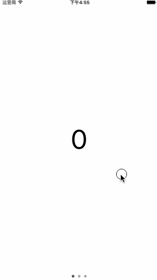

# MultiplePagesViewControllerDemo
MultiplePagesViewController objective-c and swift class for displaying multiple pages with UIPageControl.

先上截图：



demo地址：[MultiplePagesViewControllerDemo](https://github.com/hongchaozhang/MultiplePagesViewControllerDemo.git)

### demo解释

首先，创建`MultiplePagesViewController`的实例，并将其和其view加入到需要的view controller 中：

```objc

[self.view addSubview:self.multiplePagesViewController.view];
[self addChildViewController:self.multiplePagesViewController];

```

其中，`self.multiplePagesViewController`对应的getter函数如下：

```objc

- (MultiplePagesViewController*)multiplePagesViewController {
    if (!_multiplePagesViewController) {
        _multiplePagesViewController = [[MultiplePagesViewController alloc] init];
        _multiplePagesViewController.view.frame = self.view.frame;
        _multiplePagesViewController.delegate = self;
    }
    
    return _multiplePagesViewController;
}

```

并且，在`viewDidLayoutSubviews`中重新调整view的大小，以解决转屏等问题：

```objc

- (void)viewDidLayoutSubviews {
    [super viewDidLayoutSubviews];
    
    self.multiplePagesViewController.view.frame = self.view.frame;
}

```

然后，只需要将你的UIViewController的实例加入`self.multiplePagesViewController`就可以了：

```objc

- (void)addDefaultPageViewControllers {
    NSInteger vcCount = 3;
    for (NSInteger i = 0; i < vcCount; i++) {
        SampleViewController *svc = [[SampleViewController alloc] initWithText:[NSString stringWithFormat:@"%ld", i]];
        [self.multiplePagesViewController addViewController:svc];
    }
}

```

`MultiplePagesViewController`主要的两个接口如下：

```objc

/**
 *  add a new <UIViewController*> instance
 *
 *  @param viewController
 */
- (void)addViewController:(UIViewController*)viewController;

/**
 *  remove an existing view controller by index
 *
 *  @param viewControllerIndex
 */
- (void)removeViewController:(NSUInteger)viewControllerIndex;

```

另外，可以在`MultiplePagesViewController`的父view controller中实现下面接口，当切换page的时候做些其它事情，比如更新view controller的title信息等。

```objc

@protocol MultiplePagesViewControllerDelegate <NSObject>

- (void)pageChangedTo:(NSInteger)pageIndex;

@end

```


